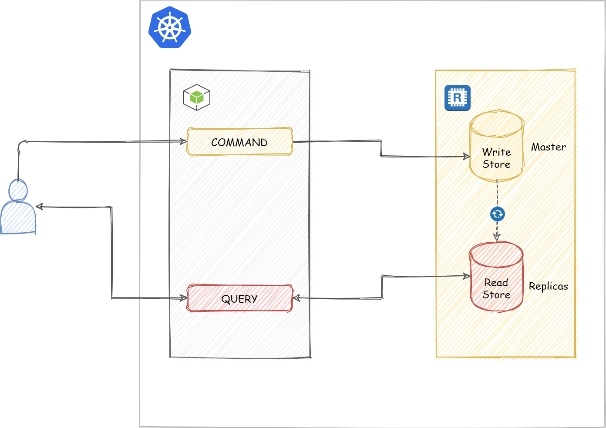
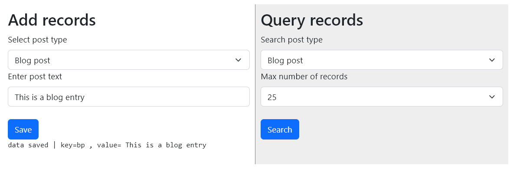

# CQRS architectural pattern sample implementation
An opinionated sample implementation of [CQRS (Command Query Responsibility Segregation)](https://docs.microsoft.com/en-us/azure/architecture/patterns/cqrs) architectural pattern on Kubernetes using NodeJS, Redis and Helm. This is only for learning and tinkering around and **SHOULD NOT BE USED in production**. It has basically three components:

* A web app written in NodeJS (which can be thought of a microservice)
* A 'write' datastore (implemented using Redis master instance)
* A 'read' datastore (implemented using Redis replica instances )




## Installing

You will need to have working Kubernetes cluster (real, K3S, minikube, microk8s anything will do !) and [helm](https://helm.sh/).

Need to add the Bitnami repo to Helm

```bash
helm repo add bitnami https://charts.bitnami.com/bitnami
```

Then, we install redis in master-replica configuration using [Bitnami's Redis Helm chart](https://bitnami.com/stack/redis/helm)

```bash
helm install  cqrs-redis bitnami/redis --set replica.replicaCount=1 --set master.count=1
```

Then we deploy the web app  using [it's docker image](https://hub.docker.com/repository/docker/code2k13/cqrs-frontend) via the deploy.yaml file.

> You may choose to build your own docker image using the Dockerfile in this repository if you don't want to use third party images.

```bash
kubectl apply -f deploy.yaml
```

You should see three pods running after the above steps, something like this

```bash
NAME                    READY   STATUS    RESTARTS       AGE
cqrs-frontend           1/1     Running   2 (30m ago)    18h
cqrs-redis-master-0     1/1     Running   2 (30m ago)    18h
cqrs-redis-replicas-0   1/1     Running   43 (65s ago)   18h
```

## Using the application

To open the application in webbrowser, you will have to proxy port 8080 of cqrs-frontend to some port on your computer

```bash
kubectl port-forward cqrs-frontend 9001:8080
```
Visiting the port 9001 for example, should show a GUI that looks like this.



The left section is for writes, clicking on 'Save' will write data to '*cqrs-redis-master-0*'. The right section is for reads, clicking on 'Search' will query '*cqrs-redis-replica-0*'. Redis internally syncs master and replicas. We could scale number of replicas if we wanted to, one of the benefits of the pattern. If the replica goes down, master is still functional and no data is lost.

## Cleanup


```bash
helm delete cqrs-redis
```

```bash
kubectl delete -f deploy.yaml
```
